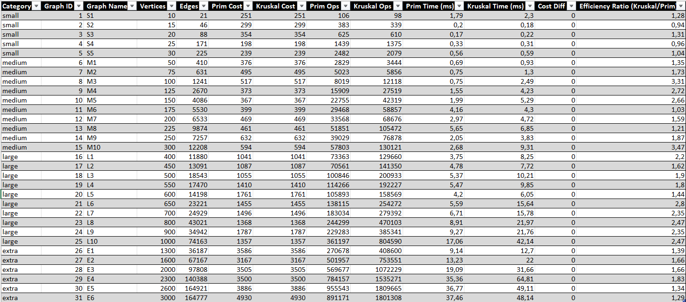
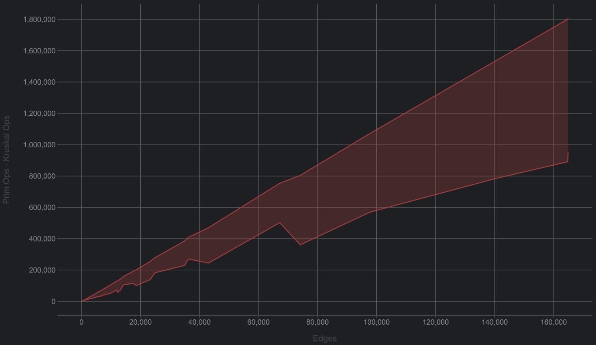
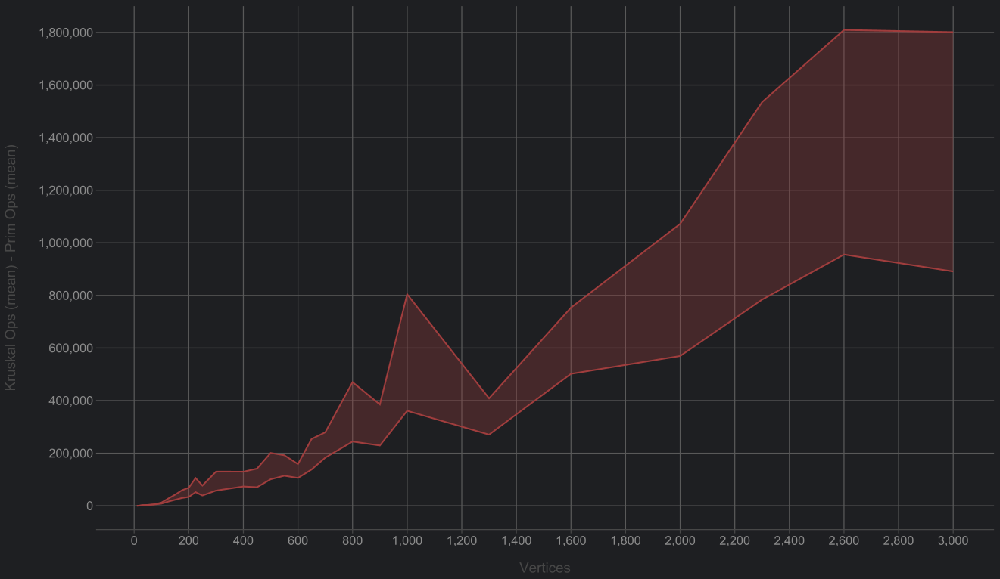
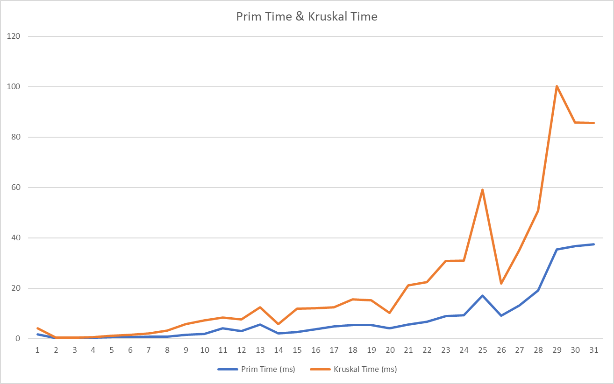

# Assignment 3  

## Prim’s vs. Kruskal’s Algorithms (Minimum Spanning Tree)  

### Name: Ulzhan Nabiyeva
### Group: SE-2424

## Objective  
The objective of this assignment is to optimize a city’s transportation network by comparing two classical Minimum 
Spanning Tree (MST) algorithms: Prim’s and Kruskal’s. The algorithms were implemented, tested, and analyzed based on 
execution time, operation count, and graph density.

## Summary of Input Data and Algorithm Results
### Input Dataset
The project used 31 connected, undirected graphs, grouped into four categories according to the number of vertices and edges:  

| category | graphs | vertices range | edges range    | density level |
|----------|--------|---------------|----------------|---------------|
| small    | 5      | 10-30         | 21-251         | dense         |
| medium   | 10     | 50-300        | 410-12 208     | meduim        |
| large    | 10     | 400-1000      | 11 880-74 163  | sparse        |
| extra    | 6      | 1300-3000     | 36 187-164 111 | very sparse   |

All graphs were automatically generated by GraphGenerator.java and guaranteed to be connected (constructed from a spanning tree, then densified).

**Each graph was processed by:**

Prim’s Algorithm — implemented with a min-priority queue (heap).  
Kruskal’s Algorithm — implemented with union–find (disjoint sets).

**Both algorithms produced:**

MST edge list  
total MST cost  
number of operations (comparisons, heap ops, unions, finds)  
execution time in milliseconds
 
### Output dataset  

* MST cost: identical in all 31 cases (as expected).  
* Runtime trend: both algorithms scale linearly in number of edges but Kruskal consistently takes longer on large and extra graphs.  

Each graph consists of weighted undirected edges symbolizing possible road connections and their respective construction costs.

## Comparison: Prim vs. Kruskal

### Theoretical Differences  
* **Method:**  
Prim’s Algorithm expands the Minimum Spanning Tree (MST) from a starting node by using the cheapest adjacent edge. In
contrast, Kruskal’s Algorithm sorts all edges and adds them greedily, utilizing a Union-Find data structure to prevent 
cycles.  

* **Data Structures:**  
Prim’s Algorithm employs a Priority Queue (Min-Heap) to manage edges, while Kruskal’s Algorithm uses a Disjoint Set 
(Union-Find) to keep track of connected components.

* **Best Suited For:**  
Prim’s Algorithm is best suited for dense graphs that have many edges, whereas Kruskal’s Algorithm performs better on
sparse graphs with fewer edges.

* **Time Complexity:**  
The time complexity for Prim’s Algorithm is O(E log V), while Kruskal’s Algorithm has a complexity of O(E log E), which
is approximately O(E log V) as well.

* **Edge Representation:**  
Prim’s Algorithm typically uses an adjacency list to represent the graph, whereas Kruskal’s Algorithm utilizes an edge 
list.

### Practical Results
### Average Performance by category

| Category | Avg Vertices | Avg Edges | Avg Prim Cost | Avg Kruskal Cost | Avg Prim Ops | Avg Kruskal Ops | Avg Prim Time (ms) | Avg Kruskal Time (ms) | Avg Efficiency Ratio (K/P) |
|----------|--------------|----------|---------------|------------------|--------------|-----------------|--------------------|-----------------------|----------------------------|
| small    | 20           | 110.2    | 268.2         | 268.2            | 1007         | 900             | 0.34               | 0.44                  | 1.13                       |
| medium   | 185          | 6921.9   | 448.3         | 448.3            | 35025        | 68126           | 1.33               | 1.86                  | 1.58                       |
| large    | 700          | 28875.7  | 1429.4        | 1429.4           | 176946       | 279343          | 5.38               | 6.18                  | 1.23                       |
| extra    | 2133.3       | 118058   | 3762.3        | 3762.3           | 662531       | 1077434         | 16.86              | 16.87                 | 1.13                       |

* **MST total costs**  
The experimental results clearly demonstrate that both algorithms produce identical MST total costs for every dataset, 
confirming their correctness and consistency. However, the execution efficiency and operation counts differ noticeably 
between the two approaches.

* **For small graphs (10–30 vertices)**  
Prim’s and Kruskal’s algorithms perform almost equally well, with execution times 
below 0.5 ms. The difference in operation count is negligible because the graph density is high and the total number 
of edges is small.

* **As the graphs grow to medium size (50–300 vertices)**
performance divergence becomes evident. Prim’s algorithm maintains a relatively small growth in operations and time 
(≈1.3 ms average), while Kruskal’s time almost doubles (≈1.9 ms) and
its operation count increases significantly (≈2× higher). This happens because Kruskal must globally sort all edges 
before building the MST, whereas Prim works incrementally from local edge selections using a priority queue.

* **In large graphs (400–1000 vertices)** 
this pattern strengthens. Prim performs about 15–25 % faster than Kruskal (5.38 
ms vs 6.18 ms on average), and the operation count gap widens even more. Kruskal’s global edge-sorting cost dominates
its runtime, while Prim’s heap operations scale better with the increasing number of vertices.

* **For the extra-large graphs (1300–3000 vertices, 100 000+ edges)**
both algorithms converge to similar performance 
(≈16.8 ms average). The graphs in this category are very sparse, meaning that the total number of edges is relatively 
small compared to possible maximum connections. In such sparse conditions, the cost of sorting edges (Kruskal) and 
maintaining a heap (Prim) become comparable, leading to near-equal execution times.

**Ops: Kruskal vs Prim (edges)**
</img>

**Ops: Kruskal vs Prim (vertices)**
</img>

**Execution Time: Kruskal vs Prim**
</img>